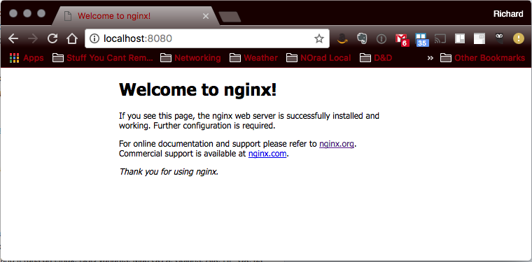

# Publishing Network Interfaces

Docker Documentation References:

[docker run](https://docs.docker.com/engine/reference/commandline/run/)

## Intent

The purpose of this kata is to familiarize yourself with the process of exposing a network port on a running Docker Container

## Overview

In this exercise, we will run a simple [NGINX](http://nginx.org/) image and publish its network interface.

## Kata Steps

**Command**

```bash
docker run --detach --publish 8080:80 nginx:stable-alpine
```

> Here, --detach causes the container to run as a daemon and --publish maps localhost port 8080 to the containers port 80

**Output**

```bash
thought:DockerKata rich$ docker run --detach --publish 8080:80 nginx:stable-alpine
91b256c402a1cb4ed6745c7621be6346689236387208284cf58df430e812e248
```

### Test the running container

**Command** (in another terminal):

```bash
open http://localhost:8080
```

Or [click here](http://localhost:8080)



### Stop the running container

**Command**

```bash
docker stop 91b256c402a1cb4ed6745c7621be6346689236387208284cf58df430e812e248
```

**Output**

```bash
thought:DockerKata rich$ docker stop 91b256c402a1cb4ed6745c7621be6346689236387208284cf58df430e812e248
91b256c402a1cb4ed6745c7621be6346689236387208284cf58df430e812e248
```


[Previous](18_overriding_envvars.md) | [Index](README.md) | [Next](20_mounting_volumes.md)
